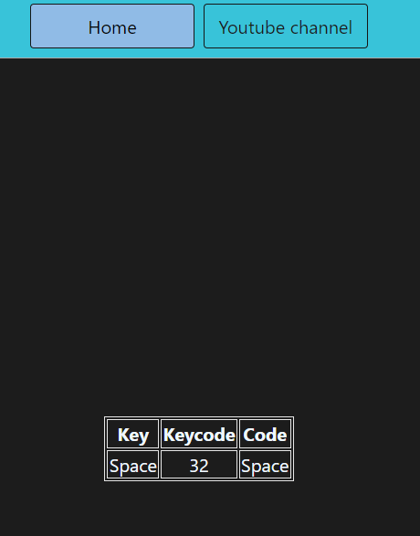

# Projects

[Repo Link Here!](https://github.com/bhavya1006/js-project/tree/main)

### Preview


# My-built-projects

## Project 1

### Preview


### Code
```javascript
console.log('Hello World!');
const buttons = document.querySelectorAll('.button');
const body = document.querySelector('body');


buttons.forEach( function (button) {
    // console.log(button);
    button.addEventListener('click',(event)=>{
        // console.log(event);
        // console.log(event.target.id);

        if (event.target.id === 'grey') {
            body.style.backgroundColor = event.target.id;
        } else if (event.target.id === 'white'){
            body.style.backgroundColor = event.target.id;
        } else if (event.target.id === 'yellow'){
            body.style.backgroundColor = event.target.id;
        } else if (event.target.id === 'blue'){
            body.style.backgroundColor = event.target.id;
        } else if (event.target.id === 'purple'){
            body.style.backgroundColor = event.target.id;
        }
    })
})

```

---

## Project 2
### Preview


### Code
```javascript
console.log("hello world");

// Default action happening

// const height = document.querySelector('#height')
// const weight = document.querySelector('#weight')
// const result = document.querySelector('#results')

// const button = document.querySelector('button')

// button.addEventListener('click',function (e) {
//     return result.appendChild(document.createTextNode(weight.value/(height.value**2)));
// })


// Default not action happening as we are taking submitted value
const form = document.querySelector('form');

// after pressing the value would be empty value
// const height = parseInt(document.querySelector('#height').value);
// const weight = parseInt(document.querySelector('#weight').value);

form.addEventListener('submit', function(e){
    e.preventDefault();

    // here the event is for submission, so value will be submitted
    const height = parseInt(document.querySelector('#height').value);
    const weight = parseInt(document.querySelector('#weight').value);
    const result = document.querySelector('#results')
    const output = document.querySelector('#output')

    if (height === '' || height<=0 || 
    // height != NaN not a better technique
    // better technique
    isNaN(height)
    ) {
        result.innerHTML = `Please give a valid height ${height}`
    } else if (weight === '' || weight<=0 || 
    // weight != NaN not a better technique
    // better technique
    isNaN(weight)
    ) {
        result.innerHTML = `Please give a valid weight ${weight}`
    } else {
        const bmi = (weight / ((height**2)/10000)).toFixed(2)
        result.innerHTML = `<span>${bmi}</span>`

        // assignment done
        
        if (bmi<18.6) {
            output.innerHTML = `<span>Under Weight</span>`
        } else if (bmi>= 18.6 && bmi <= 24.9) {
            output.innerHTML = `<span>Normal Range</span>`
        } else if (bmi>24.9){
            output.innerHTML = `<span>Over Weight</span>`
        } else {
            output.innerHTML = ``
        }
    }

})
```

## Project 3
### Preview


### Code
```javascript
console.log("Hello World!");
const clock = document.getElementById('clock')
// const clock = document.querySelector('#clock')


setInterval(function(){
    let date = new Date()
    // console.log(date.toLocaleTimeString());
    
    clock.innerHTML = date.toLocaleTimeString();
},1000)

```


## Project 4
### Preview


### Code
```javascript
console.log("Hello World!");
let randomNumber = parseInt(Math.random() * 100 + 1);

const submit = document.querySelector('#subt');
const userInput = document.querySelector('#guessField');
const guessSlot = document.querySelector('.guesses');
const remaining = document.querySelector('.lastResult');
const lowOrHi = document.querySelector('.lowOrHi');
const startOver = document.querySelector('.resultParas');

const p = document.createElement('p');


let prevGuess = [];
let numGuess = 1;

let playGame = true;

if (playGame) {
    submit.addEventListener('click',function(e) {
        e.preventDefault();

        const guess = parseInt(userInput.value);
        // console.log(guess);
        validateGuess(guess);
    })
}

function validateGuess(guess) {
    // to check the input
    if (isNaN(guess)){
        alert("Please enter a valid number!")
    } else if (guess<1){
        alert("Please enter a number more than 1!")
    } else if (guess>100){
        alert("Please enter a number less than 100!")
    } else {
        prevGuess.push(guess);

        if (numGuess === 10) {
            displayGuess(guess);
            displayMsg(`Game Over, Random number was ${randomNumber}`);
            endGame();
        } else {
            displayGuess(guess)
            checkGuess(guess)
        }
    }
}

function checkGuess(guess) {
    // high or low or near --> condition for logic
    if (guess === randomNumber) {
        displayMsg(`You guess the number right!`);
        endGame()
    } else if (guess < randomNumber){
        displayMsg(`Your number is too low!`);

    } else if (guess > randomNumber){
        displayMsg(`Your number is too high!`);

    }
}

function displayGuess(guess) {
    // display the no guess left | clean up method
    userInput.value = ''
    guessSlot.innerHTML += `${guess} `
    numGuess++;
    remaining.innerHTML = `${11-numGuess}`
}

function displayMsg(msg) {
    // will display value as a message
    lowOrHi.innerHTML = `<h2>${msg}</h2>`;
}

function endGame() {
    // ends the game
    userInput.value = ''
    userInput.setAttribute('disabled', '')

    playGame = false;

    p.classList.add('button')
    p.innerHTML = `<h2 id='newGame'>Start new Game</h2>`

    startOver.appendChild(p)

    let ngbtn = document.querySelector('#newGame');
    ngbtn.setAttribute('style','border: #fff solid 2.1px; border-radius: 10px; margin: 30px 24%;padding: 7px 3px;background-color: #4545456e; color: #ffa900;border-style: none;')
    newGame();
}

function newGame() {
    const newGameButton = document.querySelector('#newGame')
    newGameButton.addEventListener('click', function(e) {

        randomNumber = parseInt(Math.random() * 100 + 1);
        prevGuess = []
        numGuess = 1
        guessSlot.innerHTML = ``
        remaining.innerHTML = `${11-numGuess}`
        userInput.removeAttribute('disabled')

        startOver.removeChild(p)

        playGame = true
    })
}

```

## Project 5
### Preview


### Code
```javascript
console.log("Hello World!");
const insert = document.querySelector('#insert')

window.addEventListener('keydown',(e)=>{
    insert.innerHTML = `
    <div class='color'>
        <table>
            <tr>
                <th>Key</th>
                <th>Keycode</th>
                <th>Code</th>
            </tr>
            <tr>
                <td>${e.key === " "?"Space":e.key}</td>
                <td>${e.keyCode}</td>
                <td>${e.code}</td>
            </tr>
        </table>
    </div>
    `
})

```

## Project 6
### Preview


### Code
```javascript
console.log("Hello World!");
// generate a random color

const randomColor = function() {
    const hex = '123456789ABCDEF';
    let color = '#'
    for (let i = 0; i < 6; i++) {
        color += hex[Math.floor(Math.random() * 15)];
    }
    console.log(color);
    return color;
};

// My code

document.querySelector('#start').addEventListener('click',function(){
    let intervalId = setInterval(function(){
        document.body.style.backgroundColor = randomColor();
    },1000)

    document.querySelector('#stop').addEventListener('click',function(){
        clearInterval(intervalId);
    })
},false)


// chai aur code's code

// let intervalId;

// const startChangingColor = function(){
//     // console.log('no issue');
//     if (!intervalId){
//         intervalId = setInterval(changBgColor,1000);
//     }

//     function changBgColor(){
//         document.body.style.backgroundColor = randomColor();
//     }
// };
// const stopChangingColor = function(){
//     clearInterval(intervalId);
//     intervalId = null;
// };

// document.querySelector('#start').addEventListener('click',startChangingColor,false)
// document.querySelector('#stop').addEventListener('click',stopChangingColor)

```